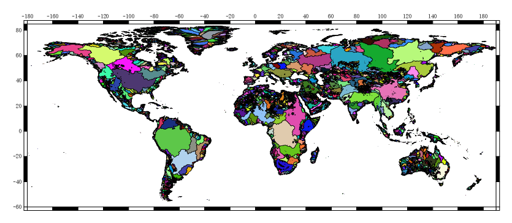

[//]: <> (Extracting data files)
[//]: <> (jquery library call is associated with the apperance of red box upon click)
[//]: <> (https://www.w3schools.com/jquery/jquery_get_started.asp)
[//]: <> (https://jquery.com/download/)
[//]: <> ()

[comment]: page base on documentation.md
[//]: <> (for div grid layout SEE:)
[//]: <> (https://stackoverflow.com/questions/17394820/understanding-div-classes-in-foundation-4)
[//]: <> (https://get.foundation/sites/docs-v5/components/grid.html)

**Table of Contents**
{: #toc }
*  TOC
{:toc}

<!-- /.medium-4.columns -->

----------------------------------------------------------------------------------------------
# Grid map

	

	

	

	

	

	

	

	

	
	

	
	

	

	

	

	

	

	

	

	

	

	

	

	

	

	

	

	

	
	

	
	

	

	

	

	

	

	

	

	

	

	

	

	

	

	

	

	
	

	
	

	

	

	

	

	

	

	

	

	
	

	

	

	

	

	

	
	

	
	

	

	

	

	

	

	

	

	

	

	

	

	

	

	

	

	
	

	
	

	

	

	

	

	

	

	

	

	

	

	

	

	

	

	

	

	
	

	
	

	

	

	

	

	

	

	

	

	

	

	

	
	

	
	

	

	

	

	

	

	

	

	

 
----------------------------------------------------------------------------------------------
--------------------------------------------------------------------------------------------
[//]: <> (Directory for: r.watershed)
# r.watershed

Base and network layers of Hydrography90m: flow accumulation, flow direction, drainage basins, outlets, stream segments, subcatchments,
regional units and depression; Map reference corresponding to Figure 6 for raster visualisation and Figure 5 for vector visualisation;
Unit; Commands for computation and output file names. The asterisk stands for the regular tile ID for downloading the data, available
in 20ox 20o tiles at https://public.igb-berlin.de/index.php/s/agciopgzXjWswF4

<table style="width:100% background-image= none">
	<tr>
		<th colspan="2" style="font-size: 18px;">Flow Accumulation</th>
	</tr>
	<tr>
		<td rowspan="1">
			
		</td>
		<td>    
			<ul>
				<li><a href="https://public.igb-berlin.de/index.php/s/agciopgzXjWswF4?path=%2Fr.watershed%2Faccumulation_tiles20d" target="_blank"> accumulation_*.tif (raster)</a></li>
				<li><a href="">**NEED** Raster layer visualization</a></li>
			</ul>
		</td>
	</tr>
	<tr>
		<th colspan="2" style="font-size: 18px;">Drainage Basin</th>
	</tr>
	<tr>
		<td rowspan="1">
			
		</td>
		<td>    
			<ul>
				<li><a href="https://public.igb-berlin.de/index.php/s/agciopgzXjWswF4?path=%2Fr.watershed%2Fbasin_tiles20d" target="_blank"> basin_*.tif (raster)</a></li>
				<li><a href="https://public.igb-berlin.de/index.php/s/agciopgzXjWswF4?path=%2Fr.watershed%2Fbasin_tiles20d" target="_blank">basin_*.gpkg (vector)</a></li>
				<li><a href="https://geo.igb-berlin.de/layers/:geonode:hydrography90m_v1_basin_cog" target="blank">Raster layer visualization</a></li>
			</ul>
		</td>
	</tr>
	<tr>
		<th colspan="2" style="font-size: 18px;">Flow Direction</th>
	</tr>
	<tr>
		<td rowspan="1">
			
		</td>
		<td>    
			<ul>
				<li><a href="https://public.igb-berlin.de/index.php/s/agciopgzXjWswF4?path=%2Fr.watershed%2Fdirection_tiles20d" target="_blank"> direction_*.tif (raster)</a></li>
				<li><a href="https://geo.igb-berlin.de/layers/:geonode:hydrography90m_v1_direction_cog" target="blank">Raster layer visualization</a></li>
			</ul>
		</td>
	</tr>
	<tr>
		<th colspan="2" style="font-size: 18px;">Outlets</th>
	</tr>
	<tr>
		<td rowspan="1">
			
		</td>
		<td>    
			<ul>
				<li><a href="https://public.igb-berlin.de/index.php/s/agciopgzXjWswF4?path=%2Fr.watershed%2Foutlet_tiles20d" target="_blank"> outlet_*.tif (raster)</a></li>
				<li><a href="https://public.igb-berlin.de/index.php/s/agciopgzXjWswF4?path=%2Fr.watershed%2Foutlet_tiles20d" target="_blank">outlet_*.gpkg (vector)</a></li>
				<li><a href="" target="blank">**NEED** Raster layer visualization</a></li>
			</ul>
		</td>
	</tr>
	<tr>
		<th colspan="2" style="font-size: 18px;">Stream Segment</th>
	</tr>
	<tr>
		<td rowspan="1">
			
		</td>
		<td>    
			<ul>
				<li><a href="https://public.igb-berlin.de/index.php/s/agciopgzXjWswF4?path=%2Fr.watershed%2Fsegment_tiles20d" target="_blank"> segment_*.tif (raster)</a></li>
				<li><a href="" target="blank">**NEED** Raster layer visualization</a></li>
			</ul>
		</td>
	</tr>
	<tr>
		<th colspan="2" style="font-size: 18px;">Sub-catchment</th>
	</tr>
	<tr>
		<td rowspan="1">
			
		</td>
		<td>    
			<ul>
				<li><a href="https://public.igb-berlin.de/index.php/s/agciopgzXjWswF4?path=%2Fr.watershed%2Fsub_catchment_tiles20d" target="_blank">sub_catchment_*.tif (raster)</a></li>
				<li><a href="https://public.igb-berlin.de/index.php/s/agciopgzXjWswF4?path=%2Fr.watershed%2Fsub_catchment_tiles20d" target="_blank">sub_catchment_*.gpkg (vector)</a></li>
				<li><a href="https://geo.igb-berlin.de/layers/:geonode:hydrography90m_v1_sub_catchment_cog" target="blank">Raster layer visualization</a></li>
			</ul>
		</td>
	</tr>
	<tr>
		<th colspan="2" style="font-size: 18px;">Depression</th>
	</tr>
	<tr>
		<td rowspan="1">
			
		</td>
		<td>    
			<ul>
				<li><a href="https://public.igb-berlin.de/index.php/s/agciopgzXjWswF4?path=%2Fr.watershed%2Fdepression_tiles20d" target="_blank"> Depression (raster)</a></li>
				<li><a href="https://geo.igb-berlin.de/maps/new?layer=geonode:hydrography90m_v1_stream_order_strahler_cog&view=True" target="blank">Raster layer visualization</a></li>
			</ul>
		</td>
	</tr>
</table>

------------------------------------------------------------------------------------------------------------------------------------------------------------------------

[//]: <> (Directory for: r.stream.slope)
# r.stream.slope

Curvature, gradient (elevation difference divided by distance), and elevation difference raster maps computed with the r.stream.slope
GRASS GIS module; map reference corresponding to Figure 11; specific GRASS GIS command; and output layer name.

<table style="width:100%">
	<tr>
		<th colspan="2" style="font-size: 18px; width: 40%;">Maximum curvature between highest upstream cell, focal cell and downstream cell</th>
	</tr>
	<tr>
		<td rowspan="1">
			
		</td>
		<td>    
			<ul>
				<li><a href="https://public.igb-berlin.de/index.php/s/agciopgzXjWswF4?path=%2Fr.stream.slope%2Fslope_curv_max_dw_cel_tiles20d" target="_blank"> slope_curv_max_dw_cel_*.tif (raster)</a></li>
				<li><a href="" target="blank">**NEED** Raster layer visualization</a></li>
			</ul>
		</td>
	</tr>
	<tr>
		<th colspan="2" style="font-size: 18px;">Minimum curvature between lowest upstream cell, focal cell and downstream cell.</th>
	</tr>
	<tr>
		<td rowspan="1">
			
		</td>
		<td>    
			<ul>
				<li><a href="https://public.igb-berlin.de/index.php/s/agciopgzXjWswF4?path=%2Fr.stream.slope%2Fslope_curv_min_dw_cel_tiles20d" target="_blank"> slope_curv_min_dw_cel_*.tif (raster)</a></li>
				<li><a href="" target="blank">**NEED** Raster layer visualization</a></li>
			</ul>
		</td>
	</tr>
	<tr>
		<th colspan="2" style="font-size: 18px;">Elevation difference between focal cell and downstream cell</th>
	</tr>
	<tr>
		<td rowspan="1">
			
		</td>
		<td>    
			<ul>
				<li><a href="https://public.igb-berlin.de/index.php/s/agciopgzXjWswF4?path=%2Fr.stream.slope%2Fslope_elv_dw_cel_tiles20d" target="_blank"> slope_elv_dw_cel_*.tif (raster)</a></li>
				<li><a href="" target="blank">**NEED** Raster layer visualization</a></li>
			</ul>
		</td>
	</tr>
	<tr>
		<th colspan="2" style="font-size: 18px;">Focal cell gradient</th>
	</tr>
	<tr>
		<td rowspan="1">
			
		</td>
		<td>    
			<ul>
				<li><a href="https://public.igb-berlin.de/index.php/s/agciopgzXjWswF4?path=%2Fr.stream.slope%2Fslope_grad_dw_cel_tiles20d" target="_blank"> slope_grad_dw_cel_*.tif (raster)</a></li>
				<li><a href="" target="blank">**NEED** Raster layer visualization</a></li>
			</ul>
		</td>
	</tr>
</table>

------------------------------------------------------------------------------------------------------------------------------------------------------------------------

[//]: <> (Directory for r.stream.distance)

# r.stream.distance

    Stream/outlet distance and elevation difference raster maps computed with the r.stream.distance GRASS GIS module; map reference
corresponding to Figure 12; unit; GRASS GIS command; and output layer name.

<table style="width:100%">
	<tr>
		<th colspan="2" style="font-size: 18px;">Shortest upstream distance between focal grid cell and the nearest sub-catchment drainage divide</th>
	</tr>
	<tr>
		<td rowspan="1">
			
		</td>
		<td>    
			<ul>
				<li><a href="https://public.igb-berlin.de/index.php/s/agciopgzXjWswF4?path=%2Fr.stream.distance%2Fstream_dist_up_near_tiles20d" target="_blank"> stream_dist_up_near_*.tif (raster)</a></li>
				<li><a href="" target="blank">**NEED** Raster layer visualization</a></li>
			</ul>
		</td>
	</tr>
	<tr>
		<th colspan="2" style="font-size: 18px;">Longest upstream distance between focal grid cell and the nearest sub-catchment drainage divide</th>
	</tr>
	<tr>
		<td rowspan="1">
			
		</td>
		<td>    
			<ul>
				<li><a href="https://public.igb-berlin.de/index.php/s/agciopgzXjWswF4?path=%2Fr.stream.distance%2Fstream_dist_dw_near_tiles20d" target="_blank"> stream_dist_up_farth_*.tif (raster)</a></li>
				<li><a href="" target="blank">**NEED** Raster layer visualization</a></li>
			</ul>
		</td>
	</tr>
	<tr>
		<th colspan="2" style="font-size: 18px;">Distance between focal grid cell and its nearest downstream stream grid cell</th>
	</tr>
	<tr>
		<td rowspan="1">
			
		</td>
		<td>    
			<ul>
				<li><a href="https://public.igb-berlin.de/index.php/s/agciopgzXjWswF4?path=%2Fr.stream.distance%2Fstream_dist_up_farth_tiles20d" target="_blank"> stream_dist_dw_near_*.tif (raster)</a></li>
				<li><a href="" target="blank">**NEED** Raster layer visualization</a></li>
			</ul>
		</td>
	</tr>
	<tr>
		<th colspan="2" style="font-size: 18px;">Distance between focal grid cell and the outlet grid cell in the network</th>
	</tr>
	<tr>
		<td rowspan="1">
			
		</td>
		<td>    
			<ul>
				<li><a href="https://public.igb-berlin.de/index.php/s/agciopgzXjWswF4?path=%2Fr.stream.distance%2Foutlet_dist_dw_basin_tiles20d" target="_blank"> outlet_dist_dw_basin_*.tif (raster)</a></li>
				<li><a href="" target="blank">**NEED** Raster layer visualization</a></li>
			</ul>
		</td>
	</tr>
	<tr>
		<th colspan="2" style="font-size: 18px;">Distance between focal grid cell and the downstream stream node grid cell</th>
	</tr>
	<tr>
		<td rowspan="1">
			
		</td>
		<td>    
			<ul>
				<li><a href="https://public.igb-berlin.de/index.php/s/agciopgzXjWswF4?path=%2Fr.stream.distance%2Foutlet_dist_dw_scatch_tiles20d" target="_blank"> outlet_dist_dw_scatch_*.tif (raster)</a></li>
				<li><a href="" target="blank">**NEED** Raster layer visualization</a></li>
			</ul>
		</td>
	</tr>
	<tr>
		<th colspan="2" style="font-size: 18px;">Euclidean distance between focal grid cell and the stream network</th>
	</tr>
	<tr>
		<td rowspan="1">
			
		</td>
		<td>    
			<ul>
				<li><a href="https://public.igb-berlin.de/index.php/s/agciopgzXjWswF4?path=%2Fr.stream.distance%2Fstream_dist_proximity_tiles20d" target="_blank"> stream_dist_proximity_*.tif (raster)</a></li>
				<li><a href="" target="blank">**NEED** Raster layer visualization</a></li>
			</ul>
		</td>
	</tr>
	<tr>
		<th colspan="2" style="font-size: 18px;">Elevation difference of the shortest path from focal grid cell to the sub-catchment drainage divide</th>
	</tr>
	<tr>
		<td rowspan="1">
			
		</td>
		<td>    
			<ul>
				<li><a href="https://public.igb-berlin.de/index.php/s/agciopgzXjWswF4?path=%2Fr.stream.distance%2Fstream_diff_up_near_tiles20d" target="_blank"> stream_diff_up_near_*.tif (raster)</a></li>
				<li><a href="" target="blank">**NEED** Raster layer visualization</a></li>
			</ul>
		</td>
	</tr>
	<tr>
		<th colspan="2" style="font-size: 18px;">Elevation difference of the longest path from focal grid cell to the sub-catchment drainage divide</th>
	</tr>
	<tr>
		<td rowspan="1">
			
		</td>
		<td>    
			<ul>
				<li><a href="https://public.igb-berlin.de/index.php/s/agciopgzXjWswF4?path=%2Fr.stream.distance%2Fstream_diff_up_farth_tiles20d" target="_blank"> stream_diff_up_farth_*.tif (raster)</a></li>
				<li><a href="" target="blank">**NEED** Raster layer visualization</a></li>
			</ul>
		</td>
	</tr>
	<tr>
		<th colspan="2" style="font-size: 18px;">Elevation difference between focal grid cell and its nearest downstream stream pixel</th>
	</tr>
	<tr>
		<td rowspan="1">
			
		</td>
		<td>    
			<ul>
				<li><a href="https://public.igb-berlin.de/index.php/s/agciopgzXjWswF4?path=%2Fr.stream.distance%2Fstream_diff_dw_near_tiles20d" target="_blank"> stream_diff_dw_near_*.tif (raster)</a></li>
				<li><a href="" target="blank">**NEED** Raster layer visualization</a></li>
			</ul>
		</td>
	</tr>
	<tr>
		<th colspan="2" style="font-size: 18px;">Elevation difference between focal grid cell and the outlet grid cell in the network</th>
	</tr>
	<tr>
		<td rowspan="1">
			
		</td>
		<td>    
			<ul>
				<li><a href="https://public.igb-berlin.de/index.php/s/agciopgzXjWswF4?path=%2Fr.stream.distance%2Foutlet_diff_dw_basin_tiles20d" target="_blank"> outlet_diff_dw_basin_*.tif (raster)</a></li>
				<li><a href="" target="blank">**NEED** Raster layer visualization</a></li>
			</ul>
		</td>
	</tr>
	<tr>
		<th colspan="2" style="font-size: 18px;">Elevation difference between focal grid cell and the downstream stream node grid cell</th>
	</tr>
	<tr>
		<td rowspan="1">
			
		</td>
		<td>    
			<ul>
				<li><a href="https://public.igb-berlin.de/index.php/s/agciopgzXjWswF4?path=%2Fr.stream.distance%2Foutlet_diff_dw_scatch_tiles20d" target="_blank"> outlet_diff_dw_scatch_*.tif (raster)</a></li>
				<li><a href="" target="blank">**NEED** Raster layer visualization</a></li>
			</ul>
		</td>
	</tr>
</table>

------------------------------------------------------------------

[//]: <> (Directory for: r.stream.slope)

# r.stream.channel

<table style="width:100%">
	<tr>
		<th colspan="2" style="font-size: 18px;">Segment downstream mean gradient between focal cell and the node/outlet</th>
	</tr>
	<tr>
		<td rowspan="1">
			
		</td>
		<td>    
			<ul>
				<li><a href="https://public.igb-berlin.de/index.php/s/agciopgzXjWswF4?path=%2Fr.stream.channel%2Fchannel_grad_dw_seg_tiles20d" target="_blank"> channel_grad_dw_seg_*.tif (raster)</a></li>
				<li><a href="" target="blank">**NEED** Raster layer visualization</a></li>
			</ul>
		</td>
	</tr>
	<tr>
		<th colspan="2" style="font-size: 18px;">Segment upstream mean gradient between focal cell and the init/node</th>
	</tr>
	<tr>
		<td rowspan="1">
			
		</td>
		<td>    
			<ul>
				<li><a href="https://public.igb-berlin.de/index.php/s/agciopgzXjWswF4?path=%2Fr.stream.channel%2Fchannel_grad_up_seg_tiles20d" target="_blank"> channel_grad_up_seg_*.tif (raster)</a></li>
				<li><a href="" target="blank">**NEED** Raster layer visualization</a></li>
			</ul>
		</td>
	</tr>
	<tr>
		<th colspan="2" style="font-size: 18px;">Upstream gradient between focal cell and the next cell</th>
	</tr>
	<tr>
		<td rowspan="1">
			
		</td>
		<td>    
			<ul>
				<li><a href="https://public.igb-berlin.de/index.php/s/agciopgzXjWswF4?path=%2Fr.stream.channel%2Fchannel_grad_up_cel_tiles20d" target="_blank">channel_grad_up_cel_*.tif (raster)</a></li>
				<li><a href="" target="blank">**NEED** Raster layer visualization</a></li>
			</ul>
		</td>
	</tr>
	<tr>
		<th colspan="2" style="font-size: 18px;">Cell stream course curvature of the focal cell</th>
	</tr>
	<tr>
		<td rowspan="1">
			
		</td>
		<td>    
			<ul>
				<li><a href="https://public.igb-berlin.de/index.php/s/agciopgzXjWswF4?path=%2Fr.stream.channel%2Fchannel_curv_cel_tiles20d" target="_blank">channel_curv_cel_*.tif (raster)</a></li>
				<li><a href="" target="blank">**NEED** Raster layer visualization</a></li>
			</ul>
		</td>
	</tr>
	<tr>
		<th colspan="2" style="font-size: 18px;">Segment downstream elevation difference between focal cell and the node/outlet</th>
	</tr>
	<tr>
		<td rowspan="1">
			
		</td>
		<td>    
			<ul>
				<li><a href="https://public.igb-berlin.de/index.php/s/agciopgzXjWswF4?path=%2Fr.stream.channel%2Fchannel_elv_dw_seg_tiles20d" target="_blank">channel_elv_dw_seg_*.tif (raster)</a></li>
				<li><a href="" target="blank">**NEED** Raster layer visualization</a></li>
			</ul>
		</td>
	</tr>
	<tr>
		<th colspan="2" style="font-size: 18px;">Segment upstream elevation difference between focal cell and the init/node</th>
	</tr>
	<tr>
		<td rowspan="1">
			
		</td>
		<td>    
			<ul>
				<li><a href="https://public.igb-berlin.de/index.php/s/agciopgzXjWswF4?path=%2Fr.stream.channel%2Fchannel_elv_up_seg_tiles20d" target="_blank">channel_elv_up_seg_*.tif (raster)</a></li>
				<li><a href="" target="blank">**NEED** Raster layer visualization</a></li>
			</ul>
		</td>
	</tr>
	<tr>
		<th colspan="2" style="font-size: 18px;">Upstream elevation difference between focal cell and the next cell</th>
	</tr>
	<tr>
		<td rowspan="1">
			
		</td>
		<td>    
			<ul>
				<li><a href="https://public.igb-berlin.de/index.php/s/agciopgzXjWswF4?path=%2Fr.stream.channel%2Fchannel_elv_up_cel_tiles20d" target="_blank">channel_elv_up_cel_*.tif (raster)</a></li>
				<li><a href="" target="blank">**NEED** Raster layer visualization</a></li>
			</ul>
		</td>
	</tr>
	<tr>
		<th colspan="2" style="font-size: 18px;">Downstream elevation difference between focal cell and the next cell</th>
	</tr>
	<tr>
		<td rowspan="1">
			
		</td>
		<td>    
			<ul>
				<li><a href="https://public.igb-berlin.de/index.php/s/agciopgzXjWswF4?path=%2Fr.stream.channel%2Fchannel_elv_dw_cel_tiles20d" target="_blank">channel_elv_dw_cel_*.tif (raster)</a></li>
				<li><a href="" target="blank">**NEED** Raster layer visualization</a></li>
			</ul>
		</td>
	</tr>
	<tr>
		<th colspan="2" style="font-size: 18px;">Segment downstream distance between focal cell and the node/outlet</th>
	</tr>
	<tr>
		<td rowspan="1">
			
		</td>
		<td>    
			<ul>
				<li><a href="https://public.igb-berlin.de/index.php/s/agciopgzXjWswF4?path=%2Fr.stream.channel%2Fchannel_dist_dw_seg_tiles20d" target="_blank">channel_dist_dw_seg_*.tif (raster)</a></li>
				<li><a href="" target="blank">**NEED** Raster layer visualization</a></li>
			</ul>
		</td>
	</tr>
	<tr>
		<th colspan="2" style="font-size: 18px;">Segment upstream distance between focal cell and the init/node</th>
	</tr>
	<tr>
		<td rowspan="1">
			
		</td>
		<td>    
			<ul>
				<li><a href="https://public.igb-berlin.de/index.php/s/agciopgzXjWswF4?path=%2Fr.stream.channel%2Fchannel_dist_up_seg_tiles20d" target="_blank">channel_dist_up_seg_*.tif (raster)</a></li>
				<li><a href="" target="blank">**NEED** Raster layer visualization</a></li>
			</ul>
		</td>
	</tr>
	<tr>
		<th colspan="2" style="font-size: 18px;">Upstream distance between focal cell and next cell</th>
	</tr>
	<tr>
		<td rowspan="1">
			
		</td>
		<td>    
			<ul>
				<li><a href="https://public.igb-berlin.de/index.php/s/agciopgzXjWswF4?path=%2Fr.stream.channel%2Fchannel_dist_up_cel_tiles20d" target="_blank">channel_dist_up_cel_*.tif (raster)</a></li>
				<li><a href="" target="blank">**NEED** Raster layer visualization</a></li>
			</ul>
		</td>
	</tr>
</table>

------------------------------------------------------------------

[//]: <> (Directory for: r.stream.order)

# r.stream.order

Stream order raster and vector files computed with the r.stream.order GRASS GIS module, the map reference corresponding to
Figure 14, the specific GRASS GIS command and the layer output name.

<table style="width:100%">
	<tr>
		<th colspan="2" style="font-size: 18px;">Strahler’s stream order</th>
	</tr>
	<tr>
		<td rowspan="1">
			
		</td>
		<td>    
			<ul>
				<li><a href="https://public.igb-berlin.de/index.php/s/agciopgzXjWswF4?path=%2Fr.stream.order%2Forder_strahler_tiles20d" target="_blank">order_strahler_*.tif (raster)</a></li>
				<li><a href="" target="blank">**NEED** Raster layer visualization</a></li>
			</ul>
		</td>
	</tr>
	<tr>
		<th colspan="2" style="font-size: 18px;">Shreve’s stream magnitude</th>
	</tr>
	<tr>
		<td rowspan="1">
			
		</td>
		<td>    
			<ul>
				<li><a href="https://public.igb-berlin.de/index.php/s/agciopgzXjWswF4?path=%2Fr.stream.order%2Forder_shreve_tiles20d" target="_blank">order_shreve_*.tif (raster)</a></li>
				<li><a href="" target="blank">**NEED** Raster layer visualization</a></li>
			</ul>
		</td>
	</tr>
	<tr>
		<th colspan="2" style="font-size: 18px;">Horton’s stream order</th>
	</tr>
	<tr>
		<td rowspan="1">
			
		</td>
		<td>    
			<ul>
				<li><a href="https://public.igb-berlin.de/index.php/s/agciopgzXjWswF4?path=%2Fr.stream.order%2Forder_horton_tiles20d" target="_blank">order_horton_*.tif (raster)</a></li>
				<li><a href="" target="blank">**NEED** Raster layer visualization</a></li>
			</ul>
		</td>
	</tr>
	<tr>
		<th colspan="2" style="font-size: 18px;">Hack’s stream order</th>
	</tr>
	<tr>
		<td rowspan="1">
			
		</td>
		<td>    
			<ul>
				<li><a href="https://public.igb-berlin.de/index.php/s/agciopgzXjWswF4?path=%2Fr.stream.order%2Forder_hack_tiles20d" target="_blank">order_hack_*.tif (raster)</a></li>
				<li><a href="" target="blank">**NEED** Raster layer visualization</a></li>
			</ul>
		</td>
	</tr>
	<tr>
		<th colspan="2" style="font-size: 18px;">Topological dimension of streams</th>
	</tr>
	<tr>
		<td rowspan="1">
			
		</td>
		<td>    
			<ul>
				<li><a href="https://public.igb-berlin.de/index.php/s/agciopgzXjWswF4?path=%2Fr.stream.order%2Forder_topo_tiles20d" target="_blank">order_topo_*.tif (raster)</a></li>
				<li><a href="" target="blank">**NEED** Raster layer visualization</a></li>
			</ul>
		</td>
	</tr>
	<tr>
		<th colspan="2" style="font-size: 18px;">All stream segments and nodes attributes</th>
	</tr>
	<tr>
		<td rowspan="1">
			
		</td>
		<td>    
			<ul>
				<li><a href="https://public.igb-berlin.de/index.php/s/agciopgzXjWswF4?path=%2Fr.stream.order%2Forder_vect_tiles20d" target="_blank">order_vect_*.gpkg (vector)</a></li>
			</ul>
		</td>
	</tr>
</table>

## Focal cell gradient
bla bla for r.watershed 

### Straller

Download link

### Henke

Download link

