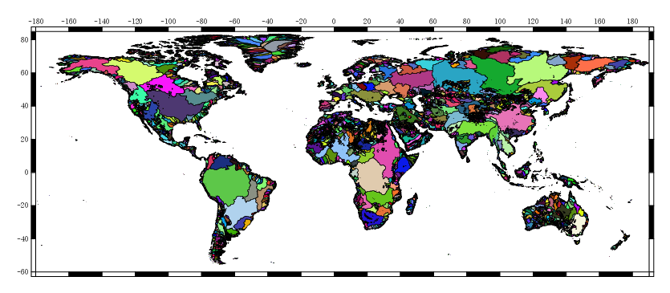

Here is an overview of all the current layers of the Hydrography90m dataset.
Please see the paper by [Amatulli et al. (2022)](https://essd.copernicus.org/preprints/essd-2022-9) for further details.  

For each computed layer is reported:
* a figure sample
* the layer file name with an asterisk which stands for the tile ID. The layer file name is a hyperlink that leads to the sub-directory [download page](https://public.igb-berlin.de/index.php/s/agciopgzXjWswF4)
* the visualization [webgis link](https://geo.igb-berlin.de/maps/351/view)

---

<iframe src="https://geo.igb-berlin.de/maps/351/embed" min-width : 900px ; style="position: absolute; top: 0; left: 0; width: 100%; height: 100%; border:0;" title="Hydrography90m" webkitallowfullscreen mozallowfullscreen allowfullscreen></iframe>

---

**Table of Contents**
{: #toc }
*  TOC
{:toc}

<!-- /.medium-4.columns -->

# Tile map

Click below on the tiled map to get the download link or use the script [here](/hydrography90m/hydrography90m_download_script) to dowloand the full data archive.  
In case of downloading multiple tiles and you want merge them use the script [here](/hydrography90m/hydrography90m_mergetile_script) 

	

	<!-- Row 0 -->
	

	

	

	

	

	

	

	
	

	
	

	

	

	

	

	

	

	

	

	

	<!-- Row 1 -->
	

	

	

	

	

	

	

	
	

	
	

	

	

	

	

	

	

	

	

	

	<!-- Row 2 -->
	

	

	

	

	

	

	
	

	
	

	

	

	

	

	

	

	

	

	<!-- Row 3 -->
	

	

	

	

	

	

	
	

	
	

	

	

	

	

	

	

	

	

	

	<!-- Row 4 -->
	

	

	

	

	

	

	
	

	
	

	

	

	

	

	

	

	

	

	

	<!-- Row 5 -->
	

	

	

	

	

	

	

	
	

	
	

	

	

	

	

	

	

	

	

	<!-- Row 6 -->
	

	

	

	
	

	
	

	

	

	

	

	

	

	

	

 

----------------------------------------------------------------------------------------------

# Input layers
Input layers to derive the Hydrography90m: MERIT HYDRO DEM, depression.
The [MERIT HYDRO DEM](https://agupubs.onlinelibrary.wiley.com/doi/10.1029/2019WR024873) can be directly download from the official [MERIT HYDRO webpage](http://hydro.iis.u-tokyo.ac.jp/~yamadai/MERIT_Hydro/)
The depression layer is stored at [r.watershed](https://public.igb-berlin.de/index.php/s/agciopgzXjWswF4?path=%2Fr.watershed) archive folder directory.

<table style="width:100% background-image= none">
	<tr>
		<th colspan="2" style="font-size: 25px;">Elevation</th>
	</tr>
	<tr>
		<td rowspan="1">
			
		</td>
		<td>    
			<ul>
				<li><a href="http://hydro.iis.u-tokyo.ac.jp/~yamadai/MERIT_Hydro/" target="_blank"> elv_*.tif (raster)</a></li>
			</ul>
		</td>
	</tr>
	<tr>
		<th colspan="2" style="font-size: 25px;">Depression</th>
	</tr>
	<tr>
		<th>Depression areas not present in the study area.</th>
		<td>  
			<ul>
			      <li><a href="https://public.igb-berlin.de/index.php/s/agciopgzXjWswF4?path=%2Fr.watershed%2Fdepression_tiles20d" target="_blank"> depression_*.tif (raster)</a></li>
			</ul>
		</td>
	</tr>
	<tr>
		<td colspan="2">

</td>
	</tr>

</table>

------------------------------------------------------------------------------------------------------------------------------------------------------------------------

[//]: <> (Directory for: r.watershed)
# Base layers
Base layers of Hydrography90m: flow accumulation, flow direction maps computed with the *r.watershed* GRASS GIS module. 
These files are stored in the [r.watershed](https://public.igb-berlin.de/index.php/s/agciopgzXjWswF4?path=%2Fr.watershed) archive folder directory.
 

<table style="width:100% background-image= none">
	<tr>
		<th colspan="2" style="font-size: 25px;">Flow accumulation</th>
	</tr>
	<tr>
		<td rowspan="1">
			
		</td>
		<td>    
			<ul>
				<li><a href="https://public.igb-berlin.de/index.php/s/agciopgzXjWswF4?path=%2Fr.watershed%2Faccumulation_tiles20d" target="_blank"> accumulation_*.tif (raster)</a></li>
				<li><a href="https://geo.igb-berlin.de/maps/new?layer=geonode:hydrography90m_v1_accumulation_cog&view=True" target="_blank" > Raster layer visualization</a></li>
			</ul>
		</td>
	</tr>
	<tr>
		<td colspan="2">

</td>
	</tr>
	<tr>
		<th colspan="2" style="font-size: 25px;">Flow direction</th>
	</tr>
	<tr>
		<td rowspan="1">
			<embed src="/images/hydrography90m/layer_images/Fig6/flow-direction.png" alt="direction_*.tif" width="320"/>
		</td>
		<td>    
			<ul>
				<li><a href="https://public.igb-berlin.de/index.php/s/agciopgzXjWswF4?path=%2Fr.watershed%2Fdirection_tiles20d" target="_blank"> direction_*.tif (raster)</a></li>
				<li><a href="https://geo.igb-berlin.de/maps/new?layer=geonode:hydrography90m_v1_direction_cog&view=True" target="_blank" > Raster layer visualization</a></li>
			</ul>
		</td>
	</tr>
	<tr>	
		<td colspan="2">

</td>
	</tr>

</table>

------------------------------------------------------------------------------------------------------------------------------------------------------------------------

[//]: <> (Directory for: r.watershed)
# Network layers
Network layers of Hydrography90m: drainage basins, stream segments, subcatchments, outlets maps computed with the *r.stream.extract* GRASS GIS module. 
These files are stored in the [r.watershed](https://public.igb-berlin.de/index.php/s/agciopgzXjWswF4?path=%2Fr.watershed) archive folder directory.

<table style="width:100% background-image= none">
	<tr>
		<th colspan="2" style="font-size: 25px;">Drainage basin</th>
	</tr>
	<tr>
		<td rowspan="1">
			
		</td>
		<td>    
			<ul>
				<li><a href="https://public.igb-berlin.de/index.php/s/agciopgzXjWswF4?path=%2Fr.watershed%2Fbasin_tiles20d" target="_blank">basin_*.tif (raster)</a></li>
				<li><a href="https://public.igb-berlin.de/index.php/s/agciopgzXjWswF4?path=%2Fr.watershed%2Fbasin_tiles20d" target="_blank">basin_*.gpkg (vector)</a></li>
				<li><a href="https://geo.igb-berlin.de/maps/new?layer=geonode:hydrography90m_v1_basin_cog&view=True" target="_blank" > Raster layer visualization</a></li>
			</ul>
		</td>
	</tr>
	<tr>	
		<td colspan="2">

</td>
	</tr>
    <tr>
		<th colspan="2" style="font-size: 25px;">Stream segment</th>
	</tr>
	<tr>
		<td rowspan="1">
			
		</td>
		<td>    
			<ul>
				<li><a href="https://public.igb-berlin.de/index.php/s/agciopgzXjWswF4?path=%2Fr.watershed%2Fsegment_tiles20d" target="_blank"> segment_*.tif (raster)</a></li>
				<li><a href="https://geo.igb-berlin.de/maps/new?layer=geonode:hydrography90m_v1_segment_cog&view=True" target="_blank" > Raster layer visualization</a></li>
			</ul>
		</td>
	</tr>
	<tr>	
		<td colspan="2">

</td>
	</tr>
    <tr>
		<th colspan="2" style="font-size: 25px;">Sub-catchment</th>
	</tr>
	<tr>
		<td rowspan="1">
			
		</td>
		<td>    
			<ul>
				<li><a href="https://public.igb-berlin.de/index.php/s/agciopgzXjWswF4?path=%2Fr.watershed%2Fsub_catchment_tiles20d" target="_blank">sub_catchment_*.tif (raster)</a></li>
				<li><a href="https://public.igb-berlin.de/index.php/s/agciopgzXjWswF4?path=%2Fr.watershed%2Fsub_catchment_tiles20d" target="_blank">sub_catchment_*.gpkg (vector)</a></li>
				<li><a href="https://geo.igb-berlin.de/maps/new?layer=geonode:hydrography90m_v1_sub_catchment_cog&view=True" target="_blank" > Raster layer visualization</a></li>
			</ul>
		</td>
	</tr>
	<tr>	
		<td colspan="2">

</td>
	</tr>
    <tr>
		<th colspan="2" style="font-size: 25px;">Outlet</th>
	</tr>
	<tr>
		<td rowspan="1">
			
		</td>
		<td>    
			<ul>
				<li><a href="https://public.igb-berlin.de/index.php/s/agciopgzXjWswF4?path=%2Fr.watershed%2Foutlet_tiles20d" target="_blank"> outlet_*.tif (raster)</a></li>
				<li><a href="https://public.igb-berlin.de/index.php/s/agciopgzXjWswF4?path=%2Fr.watershed%2Foutlet_tiles20d" target="_blank"> outlet_*.gpkg (vector)</a></li>
			</ul>
		</td>
	</tr>
	<tr>	
		<td colspan="2">

</td>
	</tr>

</table>

------------------------------------------------------------------------------------------------------------------------------------------------------------------------

[//]: <> (Directory for: r.stream.slope)
# Stream slope layers

Stream slope of Hydrography90m: curvature, gradient (elevation difference divided by distance), and elevation difference raster maps computed with the *r.stream.slope* GRASS GIS module. 
These files are stored in the [r.stream.slope](https://public.igb-berlin.de/index.php/s/agciopgzXjWswF4?path=%2Fr.stream.slope) archive folder.

<table style="width:100%">
	<tr>
		<th colspan="2" style="font-size: 18px;">Maximum curvature between highest upstream cell, focal cell and downstream cell</th>
	</tr>
	<tr>
		<td rowspan="1">
			
		</td>
		<td>    
			<ul>
			<li><a href="https://public.igb-berlin.de/index.php/s/agciopgzXjWswF4?path=%2Fr.stream.slope%2Fslope_curv_max_dw_cel_tiles20d" target="_blank"> slope_curv_max_dw_cel_*.tif (raster)</a></li>
			<li><a href="https://geo.igb-berlin.de/maps/new?layer=geonode:hydrography90m_v1_slope_curv_max_dw_cel_cog&view=True" target="_blank" > Raster layer visualization</a></li>
			</ul>
		</td>
	</tr>
	<tr>	
		<td colspan="2">

</td>
	</tr>
	<tr>
		<th colspan="2" style="font-size: 18px;">Minimum curvature between lowest upstream cell, focal cell and downstream cell.</th>
	</tr>
	<tr>
		<td rowspan="1">
			
		</td>
		<td>    
			<ul>
			<li><a href="https://public.igb-berlin.de/index.php/s/agciopgzXjWswF4?path=%2Fr.stream.slope%2Fslope_curv_min_dw_cel_tiles20d" target="_blank"> slope_curv_min_dw_cel_*.tif (raster)</a></li>
			<li><a href="https://geo.igb-berlin.de/maps/new?layer=geonode:hydrography90m_v1_slope_curv_min_dw_cel_cog&view=True" target="_blank" > Raster layer visualization</a></li>
			</ul>
		</td>
	</tr>
	<tr>	
		<td colspan="2">

</td>
	</tr>
	<tr>
		<th colspan="2" style="font-size: 18px;">Elevation difference between focal cell and downstream cell</th>
	</tr>
	<tr>
		<td rowspan="1">
			
		</td>
		<td>    
			<ul>
			<li><a href="https://public.igb-berlin.de/index.php/s/agciopgzXjWswF4?path=%2Fr.stream.slope%2Fslope_elv_dw_cel_tiles20d" target="_blank"> slope_elv_dw_cel_*.tif (raster)</a></li>
			<li><a href="https://geo.igb-berlin.de/maps/new?layer=geonode:hydrography90m_v1_slope_elv_dw_cel_cog&view=True" target="_blank" > Raster layer visualization</a></li>
			</ul>
		</td>
	</tr>
	<tr>	
		<td colspan="2">

</td>
	</tr>
	<tr>
		<th colspan="2" style="font-size: 18px;">Focal cell gradient</th>
	</tr>
	<tr>
		<td rowspan="1">
			
		</td>
		<td>    
			<ul>
			<li><a href="https://public.igb-berlin.de/index.php/s/agciopgzXjWswF4?path=%2Fr.stream.slope%2Fslope_grad_dw_cel_tiles20d" target="_blank"> slope_grad_dw_cel_*.tif (raster)</a></li>
			<li><a href="https://geo.igb-berlin.de/maps/new?layer=geonode:hydrography90m_v1_slope_grad_dw_cel_cog&view=True" target="_blank" > Raster layer visualization</a></li>
			</ul>
		</td>
	</tr>
	<tr>	
		<td colspan="2">

</td>
	</tr>
</table>

------------------------------------------------------------------------------------------------------------------------------------------------------------------------

[//]: <> (Directory for r.stream.distance)

# Stream distance layers
Stream/outlet distance of Hydrography90m: stream/outlet distance and elevation difference raster maps computed with the *r.stream.distance* GRASS GIS module. 
These files are stored in the [r.stream.distance](https://public.igb-berlin.de/index.php/s/agciopgzXjWswF4?path=%2Fr.stream.distance) archive folder.

<table style="width:100%">
	<tr>
		<th colspan="2" style="font-size: 18px;">Shortest upstream distance between focal grid cell and the nearest sub-catchment drainage divide</th>
	</tr>
	<tr>
		<td rowspan="1">
			
		</td>
		<td>    
		<ul>
		<li><a href="https://public.igb-berlin.de/index.php/s/agciopgzXjWswF4?path=%2Fr.stream.distance%2Fstream_dist_up_near_tiles20d" target="_blank"> stream_dist_up_near_*.tif (raster)</a></li>
		<li><a href="https://geo.igb-berlin.de/maps/new?layer=geonode:hydrography90m_v1_stream_dist_up_near_cel_cog&view=True" target="_blank" > Raster layer visualization</a></li>
		</ul>
		</td>
	</tr>
	<tr>	
		<td colspan="2">

</td>
	</tr>
	<tr>
		<th colspan="2" style="font-size: 18px;">Longest upstream distance between focal grid cell and the nearest sub-catchment drainage divide</th>
	</tr>
	<tr>
		<td rowspan="1">
			
		</td>
		<td>    
		<ul>
			<li><a href="https://public.igb-berlin.de/index.php/s/agciopgzXjWswF4?path=%2Fr.stream.distance%2Fstream_diff_up_farth_tiles20d" target="_blank"> stream_dist_up_farth_*.tif (raster)</a></li>
			<li><a href="https://geo.igb-berlin.de/maps/new?layer=geonode:hydrography90m_v1_stream_dist_dw_near_cel_cog&view=True" target="_blank" > Raster layer visualization</a></li>
		</ul>
		</td>
	</tr>
	<tr>	
		<td colspan="2">

</td>
	</tr>
	<tr>
		<th colspan="2" style="font-size: 18px;">Distance between focal grid cell and its nearest downstream stream grid cell</th>
	</tr>
	<tr>
		<td rowspan="1">
			
		</td>
		<td>    
		<ul>
			<li><a href="https://public.igb-berlin.de/index.php/s/agciopgzXjWswF4?path=%2Fr.stream.distance%2Fstream_dist_up_farth_tiles20d" target="_blank"> stream_dist_dw_near_*.tif (raster)</a></li>
        	<li><a href="https://geo.igb-berlin.de/maps/new?layer=geonode:hydrography90m_v1_stream_dist_up_farth_cel_cog&view=True" target="_blank" > Raster layer visualization</a></li>
		</ul>
		</td>
	</tr>
	<tr>	
		<td colspan="2">

</td>
	</tr>
	<tr>
		<th colspan="2" style="font-size: 18px;">****Distance between focal grid cell and the outlet grid cell in the network</th>
	</tr>
	<tr>
		<td rowspan="1">
			
		</td>
		<td>    
		<ul>
		<li><a href="https://public.igb-berlin.de/index.php/s/agciopgzXjWswF4?path=%2Fr.stream.distance%2Foutlet_dist_dw_basin_tiles20d" target="_blank"> outlet_dist_dw_basin_*.tif (raster)</a></li>
                <li><a href="https://geo.igb-berlin.de/maps/new?layer=geonode:hydrography90m_v1_outlet_dist_dw_basin_cel_cog&view=True" target="_blank" > Raster layer visualization</a></li>
		</ul>
		</td>
	</tr>
	<tr>
		<td colspan="2">

</td>
	</tr>
	<tr>
		<th colspan="2" style="font-size: 18px;">Distance between focal grid cell and the downstream stream node grid cell</th>
	</tr>
	<tr>
		<td rowspan="1">
			
		</td>
		<td>    
		<ul>
		<li><a href="https://public.igb-berlin.de/index.php/s/agciopgzXjWswF4?path=%2Fr.stream.distance%2Foutlet_dist_dw_scatch_tiles20d" target="_blank"> outlet_dist_dw_scatch_*.tif (raster)</a></li>
		<li><a href="https://geo.igb-berlin.de/maps/new?layer=geonode:hydrography90m_v1_outlet_dist_dw_scatch_cog&view=True" target="_blank" > Raster layer visualization</a></li>
		</ul>
		</td>
	</tr>
	<tr>
		<td colspan="2">

</td>
	</tr>
	<tr>
		<th colspan="2" style="font-size: 18px;">Euclidean distance between focal grid cell and the stream network</th>
	</tr>
	<tr>
		<td rowspan="1">
			
		</td>
		<td>    
		<ul>
		<li><a href="https://public.igb-berlin.de/index.php/s/agciopgzXjWswF4?path=%2Fr.stream.distance%2Fstream_dist_proximity_tiles20d" target="_blank"> stream_dist_proximity_*.tif (raster)</a></li>
		<li><a href="https://geo.igb-berlin.de/maps/new?layer=geonode:hydrography90m_v1_outlet_dist_proximity_cog&view=True" target="_blank" > Raster layer visualization</a></li>
		</ul>
		</td>
	</tr>
	<tr>
		<td colspan="2">

</td>
	</tr>
	<tr>
		<th colspan="2" style="font-size: 18px;">Elevation difference of the shortest path from focal grid cell to the sub-catchment drainage divide</th>
	</tr>
	<tr>
		<td rowspan="1">
			
		</td>
		<td>    
		<ul>
		<li><a href="https://public.igb-berlin.de/index.php/s/agciopgzXjWswF4?path=%2Fr.stream.distance%2Fstream_diff_up_near_tiles20d" target="_blank"> stream_diff_up_near_*.tif (raster)</a></li>
		<li><a href="https://geo.igb-berlin.de/maps/new?layer=geonode:hydrography90m_v1_outlet_dist_dw_scatch_cog&view=True" target="_blank" > Raster layer visualization</a></li>
		</ul>
		</td>
	</tr>
	<tr>
		<td colspan="2">

</td>
	</tr>
	<tr>
		<th colspan="2" style="font-size: 18px;">Elevation difference of the longest path from focal grid cell to the sub-catchment drainage divide</th>
	</tr>
	<tr>
		<td rowspan="1">
			
		</td>
		<td>    
		<ul>
		<li><a href="https://public.igb-berlin.de/index.php/s/agciopgzXjWswF4?path=%2Fr.stream.distance%2Fstream_diff_up_farth_tiles20d" target="_blank"> stream_diff_up_farth_*.tif (raster)</a></li>
		<li><a href="https://geo.igb-berlin.de/maps/new?layer=geonode:hydrography90m_v1_stream_diff_up_farth_cog&view=True" target="_blank" > Raster layer visualization</a></li>
		</ul>
		</td>
	</tr>
	<tr>
		<td colspan="2">

</td>
	</tr>
	<tr>
		<th colspan="2" style="font-size: 18px;">Elevation difference between focal grid cell and its nearest downstream stream pixel</th>
	</tr>
	<tr>
		<td rowspan="1">
			
		</td>
		<td>    
		<ul>
		<li><a href="https://public.igb-berlin.de/index.php/s/agciopgzXjWswF4?path=%2Fr.stream.distance%2Fstream_diff_dw_near_tiles20d" target="_blank"> stream_diff_dw_near_*.tif (raster)</a></li>
		<li><a href="https://geo.igb-berlin.de/maps/new?layer=geonode:hydrography90m_v1_stream_diff_dw_near_cog&view=True" target="_blank" > Raster layer visualization</a></li>
		</ul>
		</td>
	</tr>
	<tr>
		<td colspan="2">

</td>
	</tr>
	<tr>
		<th colspan="2" style="font-size: 18px;">Elevation difference between focal grid cell and the outlet grid cell in the network</th>
	</tr>
	<tr>
		<td rowspan="1">
			
		</td>
		<td>    
		<ul>
			<li><a href="https://public.igb-berlin.de/index.php/s/agciopgzXjWswF4?path=%2Fr.stream.distance%2Foutlet_diff_dw_basin_tiles20d" target="_blank"> outlet_diff_dw_basin_*.tif (raster)</a></li>
			<li><a href="https://geo.igb-berlin.de/maps/new?layer=geonode:hydrography90m_v1_outlet_diff_dw_basin_cog&view=True" target="_blank" > Raster layer visualization</a></li>
		</ul>
		</td>
	</tr>
	<tr>
		<td colspan="2">

</td>
	</tr>
	<tr>
		<th colspan="2" style="font-size: 18px;">Elevation difference between focal grid cell and the downstream stream node grid cell</th>
	</tr>
	<tr>
		<td rowspan="1">
			
		</td>
		<td>    
		<ul>
		<li><a href="https://public.igb-berlin.de/index.php/s/agciopgzXjWswF4?path=%2Fr.stream.distance%2Foutlet_diff_dw_scatch_tiles20d" target="_blank"> outlet_diff_dw_scatch_*.tif (raster)</a></li>
		<li><a href="https://geo.igb-berlin.de/maps/new?layer=geonode:hydrography90m_v1_outlet_diff_dw_scatch_cog&view=True" target="_blank" > Raster layer visualization</a></li>
		</ul>
		</td>
	</tr>
	<tr>
		<td colspan="2">

</td>
	</tr>
</table>

------------------------------------------------------------------

[//]: <> (Directory for: r.stream.channel)

# Stream segment properties layers
Stream segment properties of Hydrography90m: curvature, gradient (elevation difference divided by distance), and elevation change
raster maps computed with the *r.stream.channel* GRASS GIS module. 
These files are stored in the [r.stream.channel](https://public.igb-berlin.de/index.php/s/agciopgzXjWswF4?path=%2Fr.stream.channel) archive folder.

<table style="width:100%">
	<tr>
		<th colspan="2" style="font-size: 18px;">Segment downstream mean gradient between focal cell and the node/outlet</th>
	</tr>
	<tr>
		<td rowspan="1">
			
		</td>
		<td>    
		<ul>
		<li><a href="https://public.igb-berlin.de/index.php/s/agciopgzXjWswF4?path=%2Fr.stream.channel%2Fchannel_grad_dw_seg_tiles20d" target="_blank"> channel_grad_dw_seg_*.tif (raster)</a></li>
		<li><a href="https://geo.igb-berlin.de/maps/new?layer=geonode:hydrography90m_v1_channel_grad_dw_seg_cog&view=True" target="_blank" > Raster layer visualization</a></li>
		</ul>
		</td>
	</tr>
	 <tr>
		<td colspan="2">

</td>
	</tr>
	<tr>
		<th colspan="2" style="font-size: 18px;">Segment upstream mean gradient between focal cell and the init/node</th>
	</tr>
	<tr>
		<td rowspan="1">
			
		</td>
		<td>    
		<ul>
		<li><a href="https://public.igb-berlin.de/index.php/s/agciopgzXjWswF4?path=%2Fr.stream.channel%2Fchannel_grad_up_seg_tiles20d" target="_blank"> channel_grad_up_seg_*.tif (raster)</a></li>
		<li><a href="https://geo.igb-berlin.de/maps/new?layer=geonode:hydrography90m_v1_channel_grad_up_seg_cog&view=True" target="_blank" > Raster layer visualization</a></li>
		</ul>
		</td>
	</tr>
	<tr>
		<td colspan="2">

</td>
	</tr>
	<tr>
		<th colspan="2" style="font-size: 18px;">Upstream gradient between focal cell and the next cell</th>
	</tr>
	<tr>
		<td rowspan="1">
			
		</td>
		<td>    
		<ul>
		<li><a href="https://public.igb-berlin.de/index.php/s/agciopgzXjWswF4?path=%2Fr.stream.channel%2Fchannel_grad_up_cel_tiles20d" target="_blank">channel_grad_up_cel_*.tif (raster)</a></li>
		<li><a href="https://geo.igb-berlin.de/maps/new?layer=geonode:hydrography90m_v1_channel_grad_up_cel_cog&view=True" target="_blank" > Raster layer visualization</a></li>
		</ul>
		</td>
	</tr>
	<tr>
		<td colspan="2">

</td>
	</tr>
	<tr>
		<th colspan="2" style="font-size: 18px;">Cell stream course curvature of the focal cell</th>
	</tr>
	<tr>
		<td rowspan="1">
			
		</td>
		<td>    
		<ul>
		<li><a href="https://public.igb-berlin.de/index.php/s/agciopgzXjWswF4?path=%2Fr.stream.channel%2Fchannel_curv_cel_tiles20d" target="_blank">channel_curv_cel_*.tif (raster)</a></li>
		<li><a href="https://geo.igb-berlin.de/maps/new?layer=geonode:hydrography90m_v1_channel_curv_cel_cog&view=True" target="_blank" > Raster layer visualization</a></li>
		</ul>
		</td>
	</tr>
	<tr>
		<td colspan="2">

</td>
	</tr>
	<tr>
		<th colspan="2" style="font-size: 18px;">Segment downstream elevation difference between focal cell and the node/outlet</th>
	</tr>
	<tr>
		<td rowspan="1">
			
		</td>
		<td>    
		<ul>
		<li><a href="https://public.igb-berlin.de/index.php/s/agciopgzXjWswF4?path=%2Fr.stream.channel%2Fchannel_elv_dw_seg_tiles20d" target="_blank">channel_elv_dw_seg_*.tif (raster)</a></li>
		<li><a href="https://geo.igb-berlin.de/maps/new?layer=geonode:hydrography90m_v1_channel_elv_dw_seg_cel_cog&view=True" target="_blank" > Raster layer visualization</a></li>
		</ul>
		</td>
	</tr>
	<tr>
		<td colspan="2">

</td>
	</tr>
	<tr>
		<th colspan="2" style="font-size: 18px;">Segment upstream elevation difference between focal cell and the init/node</th>
	</tr>
	<tr>
		<td rowspan="1">
			
		</td>
		<td>    
		<ul>
		<li><a href="https://public.igb-berlin.de/index.php/s/agciopgzXjWswF4?path=%2Fr.stream.channel%2Fchannel_elv_up_seg_tiles20d" target="_blank">channel_elv_up_seg_*.tif (raster)</a></li>
		<li><a href="https://geo.igb-berlin.de/maps/new?layer=geonode:hydrography90m_v1_channel_elv_up_seg_cog&view=True" target="_blank" > Raster layer visualization</a></li>
		</ul>
		</td>
	</tr>
	<tr>
		<td colspan="2">

</td>
	</tr>
	<tr>
		<th colspan="2" style="font-size: 18px;">Upstream elevation difference between focal cell and the next cell</th>
	</tr>
	<tr>
		<td rowspan="1">
			
		</td>
		<td>    
		<ul>
		<li><a href="https://public.igb-berlin.de/index.php/s/agciopgzXjWswF4?path=%2Fr.stream.channel%2Fchannel_elv_up_cel_tiles20d" target="_blank">channel_elv_up_cel_*.tif (raster)</a></li>
		<li><a href="https://geo.igb-berlin.de/maps/new?layer=geonode:hydrography90m_v1_channel_elv_up_cel_cog&view=True" target="_blank" > Raster layer visualization</a></li>
		</ul>
		</td>
	</tr>
	<tr>
		<td colspan="2">

</td>
	</tr>
	<tr>
		<th colspan="2" style="font-size: 18px;">Downstream elevation difference between focal cell and the next cell</th>
	</tr>
	<tr>
		<td rowspan="1">
			
		</td>
		<td>    
		<ul>
		<li><a href="https://public.igb-berlin.de/index.php/s/agciopgzXjWswF4?path=%2Fr.stream.channel%2Fchannel_elv_dw_cel_tiles20d" target="_blank">channel_elv_dw_cel_*.tif (raster)</a></li>
		<li><a href="https://geo.igb-berlin.de/maps/new?layer=geonode:hydrography90m_v1_channel_elv_dw_cel_cog&view=True" target="_blank" > Raster layer visualization</a></li>
		</ul>
		</td>
	</tr>
	<tr>
		<td colspan="2">

</td>
	</tr>
	<tr>
		<th colspan="2" style="font-size: 18px;">Segment downstream distance between focal cell and the node/outlet</th>
	</tr>
	<tr>
		<td rowspan="1">
			
		</td>
		<td>    
		<ul>
		<li><a href="https://public.igb-berlin.de/index.php/s/agciopgzXjWswF4?path=%2Fr.stream.channel%2Fchannel_dist_dw_seg_tiles20d" target="_blank">channel_dist_dw_seg_*.tif (raster)</a></li>
		<li><a href="https://geo.igb-berlin.de/maps/new?layer=geonode:hydrography90m_v1_channel_dist_dw_seg_cog&view=True" target="_blank" > Raster layer visualization</a></li>
		</ul>
		</td>
	</tr>
	<tr>
		<td colspan="2">

</td>
	</tr>
	<tr>
		<th colspan="2" style="font-size: 18px;">Segment upstream distance between focal cell and the init/node</th>
	</tr>
	<tr>
		<td rowspan="1">
			
		</td>
		<td>    
		<ul>
		<li><a href="https://public.igb-berlin.de/index.php/s/agciopgzXjWswF4?path=%2Fr.stream.channel%2Fchannel_dist_up_seg_tiles20d" target="_blank">channel_dist_up_seg_*.tif (raster)</a></li>
		<li><a href="https://geo.igb-berlin.de/maps/new?layer=geonode:hydrography90m_v1_channel_dist_up_seg_cog&view=True" target="_blank" > Raster layer visualization</a></li>
		</ul>
		</td>
	</tr>
    <tr>
		<td colspan="2">

</td>
	</tr>
	<tr>
		<th colspan="2" style="font-size: 18px;">Upstream distance between focal cell and next cell</th>
	</tr>
	<tr>
		<td rowspan="1">
			
		</td>
		<td>    
		<ul>
		<li><a href="https://public.igb-berlin.de/index.php/s/agciopgzXjWswF4?path=%2Fr.stream.channel%2Fchannel_dist_up_cel_tiles20d" target="_blank">channel_dist_up_cel_*.tif (raster)</a></li>
		<li><a href="https://geo.igb-berlin.de/maps/new?layer=geonode:hydrography90m_v1_channel_dist_up_cel_cog&view=True" target="_blank" > Raster layer visualization</a></li>
		</ul>
		</td>
	</tr>
    <tr>
		<td colspan="2">

</td>
	</tr>
</table>

------------------------------------------------------------------

[//]: <> (Directory for: r.stream.order)

# Stream order layers
Stream order of Hydrography90m: stream order raster and vector files computed with the *r.stream.order* GRASS GIS module.
These files are stored in the [r.stream.order](https://public.igb-berlin.de/index.php/s/agciopgzXjWswF4?path=%2Fr.stream.order) archive folder.

<table style="width:100%">
	<tr>
		<th colspan="2" style="font-size: 18px;">Strahler’s stream order</th>
	</tr>
	<tr>
		<td rowspan="1">
			
		</td>
		<td>    
			<ul>
				<li><a href="https://public.igb-berlin.de/index.php/s/agciopgzXjWswF4?path=%2Fr.stream.order%2Forder_strahler_tiles20d" target="_blank">order_strahler_*.tif (raster)</a></li>
				<li><a href="https://geo.igb-berlin.de/maps/new?layer=geonode:hydrography90m_v1_stream_strahler_cog&view=True" target="_blank" > Raster layer visualization</a></li>
			</ul>
		</td>
	</tr>
	<tr>
		<td colspan="2">

</td>
	</tr>
	<tr>
		<th colspan="2" style="font-size: 18px;">Shreve’s stream magnitude</th>
	</tr>
	<tr>
		<td rowspan="1">
			
		</td>
		<td>    
			<ul>
				<li><a href="https://public.igb-berlin.de/index.php/s/agciopgzXjWswF4?path=%2Fr.stream.order%2Forder_shreve_tiles20d" target="_blank">order_shreve_*.tif (raster)</a></li>
				<li><a href="https://geo.igb-berlin.de/maps/new?layer=geonode:hydrography90m_v1_stream_shreve_cog&view=True" target="_blank" > Raster layer visualization</a></li>
			</ul>
		</td>
	</tr>
	<tr>
		<td colspan="2">

</td>
	</tr>
	<tr>
		<th colspan="2" style="font-size: 18px;">Horton’s stream order</th>
	</tr>
	<tr>
		<td rowspan="1">
			
		</td>
		<td>    
			<ul>
				<li><a href="https://public.igb-berlin.de/index.php/s/agciopgzXjWswF4?path=%2Fr.stream.order%2Forder_horton_tiles20d" target="_blank">order_horton_*.tif (raster)</a></li>
				<li><a href="https://geo.igb-berlin.de/maps/new?layer=geonode:hydrography90m_v1_stream_horton_cog&view=True" target="_blank" > Raster layer visualization</a></li>
			</ul>
		</td>
	</tr>
	<tr>
		<td colspan="2">

</td>
	</tr>
	<tr>
		<th colspan="2" style="font-size: 18px;">Hack’s stream order</th>
	</tr>
	<tr>
		<td rowspan="1">
			
		</td>
		<td>    
			<ul>
				<li><a href="https://public.igb-berlin.de/index.php/s/agciopgzXjWswF4?path=%2Fr.stream.order%2Forder_hack_tiles20d" target="_blank">order_hack_*.tif (raster)</a></li>
				<li><a href="https://geo.igb-berlin.de/maps/new?layer=geonode:hydrography90m_v1_stream_hack_cog&view=True" target="_blank" > Raster layer visualization</a></li>
			</ul>
		</td>
	</tr>
	    <tr>
		<td colspan="2">

</td>
	</tr>
	<tr>
		<th colspan="2" style="font-size: 18px;">Topological dimension of streams</th>
	</tr>
	<tr>
		<td rowspan="1">
			
		</td>
		<td>    
			<ul>
				<li><a href="https://public.igb-berlin.de/index.php/s/agciopgzXjWswF4?path=%2Fr.stream.order%2Forder_topo_tiles20d" target="_blank">order_topo_*.tif (raster)</a></li>
				<li><a href="https://geo.igb-berlin.de/maps/new?layer=geonode:hydrography90m_v1_stream_topo_cog&view=True" target="_blank" > Raster layer visualization</a></li>
			</ul>
		</td>
	</tr>
	<tr>
		<td colspan="2">

</td>
	</tr>
	<tr>
		<th colspan="2" style="font-size: 18px;">All stream segments and nodes attributes</th>
	</tr>
	<tr>
		<td rowspan="1">
			
		</td>
		<td>    
			<ul>
				<li><a href="https://public.igb-berlin.de/index.php/s/agciopgzXjWswF4?path=%2Fr.stream.order%2Forder_vect_tiles20d" target="_blank">order_vect_point_*.gpkg (vector)</a></li>
				<li><a href="https://public.igb-berlin.de/index.php/s/agciopgzXjWswF4?path=%2Fr.stream.order%2Forder_vect_tiles20d" target="_blank">order_vect_segment_*.gpkg (vector)</a></li>
			</ul>
		</td>
	</tr>
	<tr>
		<td colspan="2">

</td>
	</tr>
</table>

------------------------------------------------------------------

[//]: <> (Directory for: flow.index)

# Flow index layers
Flow index of Hydrography90m:  flow index computed using flow accumulation and terrain slope.
These files are stored in the [flow.index](https://public.igb-berlin.de/index.php/s/agciopgzXjWswF4?path=%2Fflow.index) archive folder.

<table style="width:100%">
	<tr>
		<th colspan="2" style="font-size: 18px;">Stream power index</th>
	</tr>
	<tr>
		<td rowspan="1">
			
		</td>
		<td>    
			<ul>
				<li><a href="https://public.igb-berlin.de/index.php/s/agciopgzXjWswF4?path=%2Fflow.index%2Fspi_tiles20d" target="_blank">spi_*.tif (raster)</a></li>
				<li><a href="https://geo.igb-berlin.de/maps/new?layer=geonode:hydrography90m_v1_spi_cog&view=True" target="_blank" > Raster layer visualization</a></li>
			</ul>
		</td>
	</tr>
	<tr>
		<td colspan="2">

</td>
	</tr>
	<tr>
		<th colspan="2" style="font-size: 18px;">Stream transportation index (sti)</th>
	</tr>
	<tr>
		<td rowspan="1">
			
		</td>
		<td>    
			<ul>
				<li><a href="https://public.igb-berlin.de/index.php/s/agciopgzXjWswF4?path=%2Fflow.index%2Fsti_tiles20d" target="_blank">sti_*.tif (raster)</a></li>
				<li><a href="https://geo.igb-berlin.de/maps/new?layer=geonode:hydrography90m_v1_sti_cog&view=True" target="_blank" > Raster layer visualization</a></li>
			</ul>
		</td>
	</tr>
	<tr>
		<td colspan="2">

</td>
	</tr>
	<tr>
		<th colspan="2" style="font-size: 18px;">Compound topographic index</th>
	</tr>
	<tr>
		<td rowspan="1">
			
		</td>
		<td>    
			<ul>
				<li><a href="https://public.igb-berlin.de/index.php/s/agciopgzXjWswF4?path=%2Fflow.index%2Fcti_tiles20d" target="_blank">cti_*.tif (raster)</a></li>
				<li><a href="https://geo.igb-berlin.de/maps/new?layer=geonode:hydrography90m_v1_cti_cog&view=True" target="_blank" > Raster layer visualization</a></li>
			</ul>
		</td>
	</tr>
	<tr>
		<td colspan="2">

</td>
	</tr>

</table>

